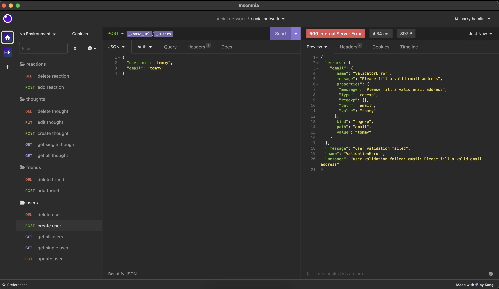

# Social Network Api

## Description

This project demonstrates the useage of MongoDB and Mongoose in the context of a social networking database.

  ## Table of Contents
1. [Installation](#installation)
2. [Usage](#usage)
3. [Contributing](#contributing)
4. [Questions](#questions)
  

## Installation

This server will first need to be launched from the command line, and then routes can be fun from Insomnia.

## Usage

To view application in use, a demonstration video can be found at: <a href="https://youtu.be/WpHAes1Jyow">https://youtu.be/WpHAes1Jyow</a>

A view of the application running in Insomnia can be found here (including a view of the email validation error being initiated):

## Contributing

<a href="https://github.com/harryhamlin">github.com/harryhamlin</a>

## Questions

For any questions, please reach out directly to <a href="mailto:harryhamlin@gmail.com" target="_blank">harryhamlin@gmail.com</a>.

