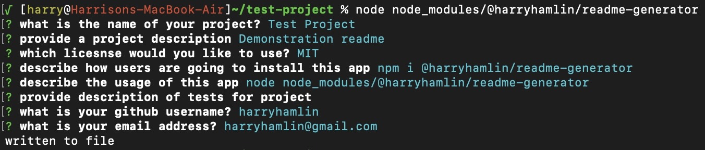

# Readme Generator

## Description

This backend node application can be installed and executed to generate a professional Readme.md

  ## Table of Contents
1. [Installation](#installation)
2. [Usage](#usage)
3. [Contributing](#contributing)
4. [Tests](#tests)
5. [Questions](#questions)
  

## Installation

Users can utilize this app most easily and practically by using the node-package-manager to install this app in the parent directory of their project. Users can install it from their terminal using the following command:

npm i @harryhamlin/readme-generator

Once installed, this application can be used to generate a high-quality professional readme as described below.

## Usage

User's can execute this application two ways. From the command line of the parent directory of node_modules, the user can use the following code in the terminal:

node node_modules/@harryhamlin/readme-generator

This will launch the program, guiding the user through a series of questions generating a high-quality readme:

The user can also include the exported function directly in their code by including the following code in a script file, and then executing that script file from the command line:

const createReadme = require('@harryhamlin/readme-generator'); createReadme 

For a more detailed video walkthrough, please refer to <a href="https://youtu.be/nVTJV6GV2Wk">this video</a>

## Contributing

<a href="https://github.com/harryhamlin">github.com/harryhamlin</a>

## Tests

The code for this application is divided into two different script files, one entitled createReadme.js that contains the Inquirer code and the code executing the functions to generate the Readme.md. The other script file, entitled generateMarkdown.js contains the code that supplies the information for Licenses, Table of Contents, and creates all md content. All are published publicly to NPM.

## Questions

For any questions, please reach out directly to <a href="mailto:harryhamlin@gmail.com" target="_blank">harryhamlin@gmail.com</a>.

